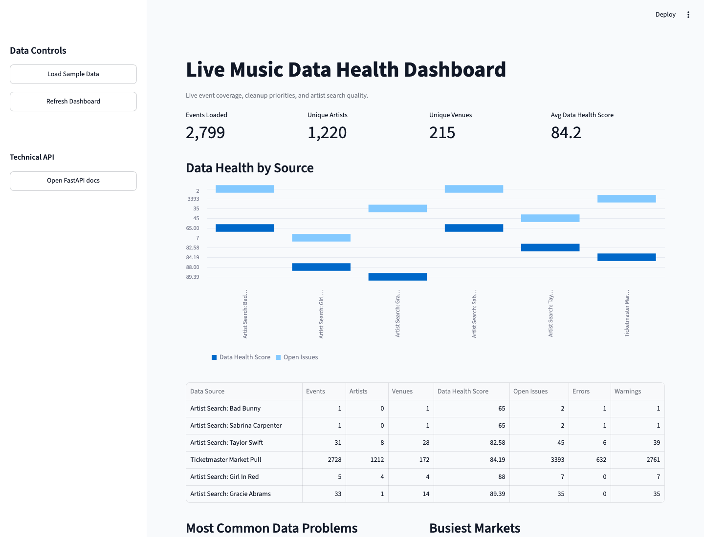
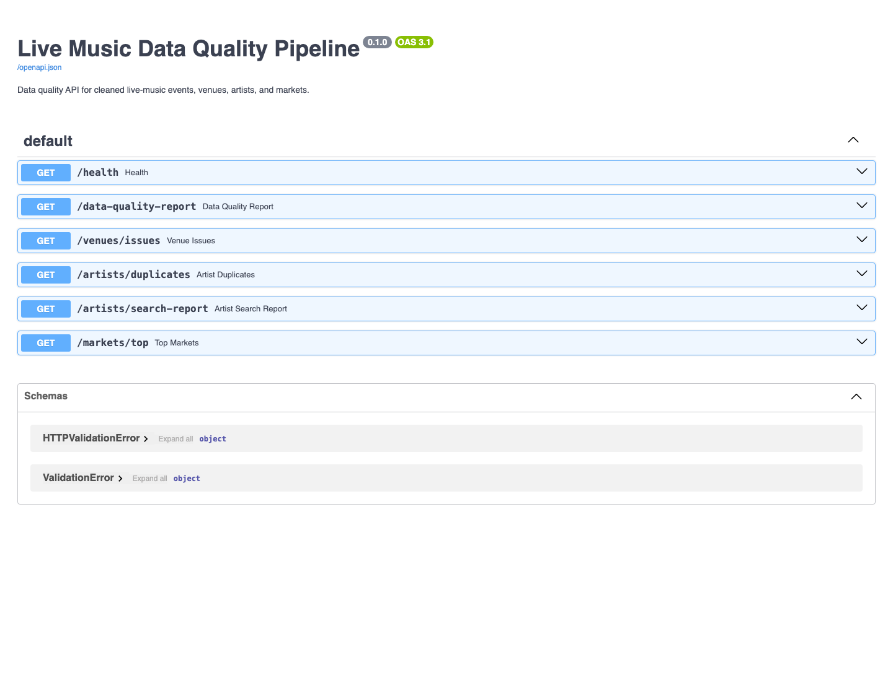
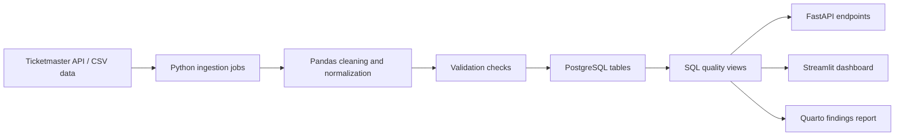

# Live Music Data Quality Pipeline

A data engineering portfolio project for cleaning and monitoring messy live-music data across APIs, CSV files, PostgreSQL, SQL validation views, FastAPI, Docker, and a Streamlit dashboard.

The project ingests concert/event data, normalizes artist, venue, market, date, genre, and location fields, detects data-quality issues, loads clean records into PostgreSQL, and exposes the results through both an API and a business-friendly dashboard.



## What This Project Proves

This project is designed to show practical data engineering skills that matter in real data operations work:

- API ingestion from a real external provider, currently Ticketmaster Discovery API.
- CSV ingestion for mock, generated, or partner-style data feeds.
- Pandas-based cleaning, normalization, chunked loading, and validation.
- PostgreSQL schema design, constraints, indexes, and SQL views.
- Data-quality checks for missing metadata, malformed dates, invalid coordinates, duplicate records, and source-level quality.
- FastAPI endpoints that expose health checks and quality reports.
- Streamlit dashboard that translates technical checks into non-technical business language.
- Docker Compose setup with PostgreSQL, FastAPI, and dashboard services.
- AWS RDS/EC2 deployment documentation for a realistic cloud path.

The main idea: **live event data is valuable, but only if artist, venue, market, and source quality are trustworthy enough to support decisions.**

## Current Findings

The project has been run against real Ticketmaster data for both market-level and artist-level analysis.

| Area | Result |
| --- | ---: |
| Events loaded | 2,799 |
| Unique artists | 1,220 |
| Unique venues | 215 |
| Average data health score | 84.22 |
| Market pulls analyzed | 5 |
| Artist searches analyzed | 6 |

Key findings:

- Ticketmaster is useful as an event source, but venue capacity is missing from every loaded event.
- Austin had the cleanest market sample among Denver, Austin, Nashville, New York, and Los Angeles.
- Nashville and New York had more missing artist metadata in the sample.
- Gracie Abrams returned a clean artist-search result set.
- Taylor Swift keyword search returned mostly tribute/fan-event listings instead of official Taylor Swift concerts.
- girl in red keyword search returned ambiguous matches such as Indigo Girls, Red Not Chili Peppers, Outside Lands, and Lily Allen.
- Kendrick Lamar returned zero rows in the current U.S. Ticketmaster pull, and the pipeline now records that as a valid completed empty run.

## Screenshots

### Dashboard

The Streamlit dashboard presents raw validation checks in non-technical language like "Data Health Score," "Open Issues," "Venues Needing Cleanup," and "Artist Search Results."


### FastAPI Docs

The FastAPI service exposes health, market, venue, artist, and data-quality endpoints.



## Architecture



## Tech Stack

- **Language:** Python
- **Data:** Pandas, SQL
- **Database:** PostgreSQL
- **API:** FastAPI
- **Dashboard:** Streamlit
- **Infrastructure:** Docker, Docker Compose
- **Cloud path:** AWS RDS and EC2 documentation
- **Testing:** Pytest, Ruff
- **Reporting:** Markdown and Quarto

## How To Run The App

### 1. Start The Services

From the project root:

```bash
docker compose up --build
```

This starts:

- PostgreSQL at `localhost:5432`
- FastAPI at `http://localhost:8000`
- Streamlit dashboard at `http://localhost:8501`

Leave this terminal running.

### 2. Open The App

Open these URLs in your browser:

- Dashboard: http://localhost:8501
- API docs: http://localhost:8000/docs
- API health check: http://localhost:8000/health

### 3. Load Demo Data

In a second terminal, generate 100k mock event rows:

```bash
docker compose run --rm app python -m app.ingestion.generate_mock_data \
  --rows 100000 \
  --output data/raw/mock_events.csv
```

Then load the data into PostgreSQL:

```bash
docker compose run --rm app python -m app.ingestion.pipeline \
  --input data/raw/mock_events.csv \
  --replace
```

Refresh the dashboard at http://localhost:8501.

### 4. Pull Real Ticketmaster Data

Create a local `.env` file:

```bash
cp .env.example .env
```

Add your Ticketmaster key:

```bash
TICKETMASTER_API_KEY=your-ticketmaster-key-here
```

Then run a market pull:

```bash
docker compose run --rm app python -m app.ingestion.ticketmaster \
  --city Denver \
  --state CO \
  --pages 2 \
  --size 200 \
  --output data/raw/ticketmaster_denver.csv \
  --load \
  --replace
```

Run an artist keyword pull:

```bash
docker compose run --rm app python -m app.ingestion.ticketmaster \
  --keyword "Gracie Abrams" \
  --country US \
  --pages 3 \
  --size 200 \
  --source-name ticketmaster_artist_gracie_abrams \
  --output data/raw/ticketmaster_artist_gracie_abrams.csv \
  --load
```

The `.env` file and raw CSV outputs are intentionally ignored by Git.

### 5. Stop The App

```bash
docker compose down
```

If you want to remove the local PostgreSQL volume too:

```bash
docker compose down -v
```

## API Endpoints

| Endpoint | Purpose |
| --- | --- |
| `GET /health` | Confirms API and database reachability |
| `GET /data-quality-report` | Overall event counts, source quality, issue types, and recent ingestion runs |
| `GET /venues/issues` | Venues missing capacity or coordinate metadata |
| `GET /artists/duplicates` | Possible duplicate artist records after normalization |
| `GET /artists/search-report` | Artist keyword search quality and returned-event summaries |
| `GET /markets/top` | Top markets by event count |

Example:

```bash
curl http://localhost:8000/data-quality-report
```

## SQL Views

The pipeline creates PostgreSQL views that support both the API and dashboard:

| View | Purpose |
| --- | --- |
| `vw_top_markets_by_event_count` | Ranks markets by event volume, artist count, venue count, and average data health |
| `vw_venues_missing_metadata` | Finds venues missing capacity or valid coordinates |
| `vw_duplicate_artist_candidates` | Flags artist fingerprints tied to multiple source artist IDs |
| `vw_duplicate_venue_candidates` | Flags venue fingerprints tied to multiple source venue IDs |
| `vw_data_quality_score_by_source` | Summarizes source-level event volume, issue counts, and quality scores |
| `vw_artist_search_quality` | Summarizes artist keyword pulls and whether returned events match the searched artist |

## Data Quality Checks

The validation layer flags:

- Missing artist names
- Missing venue names
- Missing venue capacity
- Malformed event dates
- Invalid latitude/longitude
- Invalid or ambiguous state values
- Duplicate source event IDs
- Possible duplicate artist records
- Possible duplicate venue records

The dashboard translates these into friendlier labels such as:

- `missing_venue_capacity` -> `Venue capacity missing`
- `missing_artist_name` -> `Artist name missing`
- `invalid_coordinates` -> `Coordinates need review`
- `duplicate_artist_candidate` -> `Possible duplicate artist`

## Reports

Portfolio-ready findings are included in `docs/`:

- [Quarto findings report](docs/live-music-findings.qmd)
- [Market quality report](docs/live-music-market-quality-report.md)
- [Artist search quality report](docs/live-music-artist-search-report.md)
- [AWS deployment guide](docs/aws-deployment.md)

If Quarto is installed, render the findings report with:

```bash
quarto render docs/live-music-findings.qmd
```

## Local Python Setup

Docker is the easiest way to run the project. For local development without Docker:

```bash
python3 -m venv .venv
source .venv/bin/activate
pip install -e ".[dev]"
```

Start only PostgreSQL:

```bash
docker compose up db
```

Run the API:

```bash
uvicorn app.main:app --reload
```

Run the dashboard:

```bash
streamlit run app/dashboard.py
```

Run tests and linting:

```bash
pytest
ruff check .
```

## Cloud Deployment Path

The project includes an AWS deployment guide at [docs/aws-deployment.md](docs/aws-deployment.md). The intended production-style path is:

1. Create a PostgreSQL database in AWS RDS.
2. Set `DATABASE_URL` to the RDS connection string.
3. Run ingestion jobs locally, on EC2, or in CI.
4. Deploy FastAPI on EC2 with Docker Compose or systemd.
5. Restrict RDS access so only the API host can connect.

## Troubleshooting

### Docker Is Running But The Dashboard Is Empty

Load data first:

```bash
docker compose run --rm app python -m app.ingestion.generate_mock_data \
  --rows 100000 \
  --output data/raw/mock_events.csv

docker compose run --rm app python -m app.ingestion.pipeline \
  --input data/raw/mock_events.csv \
  --replace
```

Then refresh http://localhost:8501.

### Ticketmaster Pull Says The API Key Is Missing

Make sure `.env` exists and contains:

```bash
TICKETMASTER_API_KEY=your-ticketmaster-key-here
```

Docker Compose passes this value into the `app` and `dashboard` containers.

### Port Already In Use

Check what is using the ports:

```bash
lsof -i :8000
lsof -i :8501
lsof -i :5432
```

Then stop the conflicting process or change the ports in `docker-compose.yml`.

## Resume Bullets

- Built a live-music data quality pipeline using Python, Pandas, PostgreSQL, FastAPI, Streamlit, and Docker to ingest, clean, validate, and monitor event, artist, venue, and market records from API and CSV sources.
- Implemented SQL validation checks, duplicate detection, schema constraints, and data-health reports to flag missing venue metadata, malformed dates, inconsistent market names, invalid coordinates, and duplicate artist records.
- Created artist-level search quality reporting to identify direct artist matches, tribute-event contamination, ambiguous keyword results, zero-result pulls, and missing artist metadata.
- Documented an AWS RDS/EC2 deployment path for a FastAPI service backed by PostgreSQL.
