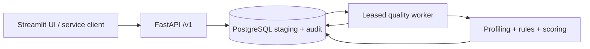

# Data Referee

Data Referee is an explainable data-quality service that answers a practical question:

> Is this dataset trustworthy enough for the job I want to perform?

It profiles CSV and JSON records, applies an immutable quality profile, separates issue severity
from disposition, classifies records as accepted, quarantined, or rejected, and reports which
analytical use cases remain trusted, require caution, or are blocked.

The original live-music pipeline is preserved at the
[`v0.1.0`](https://github.com/EnmaSantos/data-referee/releases/tag/v0.1.0)
baseline. Live Music Intelligence now consumes this product through the versioned HTTP contract
instead of sharing code or a database.

## Why the distinction matters

A warning does not automatically quarantine a record. For example, a Ticketmaster event without
venue capacity can still be accepted for event discovery and market-volume analysis while being
blocked for capacity analysis.

```text
Record classification: accepted

Usable for:
  Event discovery
  Market analysis

Blocked for:
  Venue-capacity analysis
```

Rules carry two independent signals:

```text
severity: info | warning | error | critical
action:   allow | quarantine | reject
```

## Architecture


```mermaid
flowchart LR
    U["Streamlit UI / service client"] --> A["FastAPI /v1"]
    A --> D[("PostgreSQL staging + audit")]
    W["Leased quality worker"] --> D
    D --> W
    W --> E["Profiling + rules + scoring"]
    E --> D
```

- **FastAPI** owns upload validation, idempotency, dataset sealing, pagination, and exports.
- **PostgreSQL** holds staged records, immutable profile versions, queued jobs, results, and
  content-free audit summaries.
- **The worker** claims jobs with `FOR UPDATE SKIP LOCKED`, renews expiring leases, and retries with
  exponential backoff without holding transactions during external work.
- **Streamlit** provides the account-free CSV workflow.

No service relies on a shared local filesystem. CSV rows are streamed into PostgreSQL staging so
the API and worker can run as separate containers or Render services.

## Dataset lifecycle

```text
created → receiving_records → sealed → queued → running
                                              ├→ completed
                                              └→ failed / dead_letter
                                                   ↓
                                                expired
```

- Appends are allowed only before sealing.
- Starting a quality run seals and hashes the exact input.
- Retrying uses the same sealed input; changed input requires a new dataset.
- Public row details expire after 24 hours, while aggregate run summaries and published profile
  versions are retained permanently.

## Built-in profiles

### `generic@1.0.0`

Safe checks for arbitrary tabular data, including empty and exact-duplicate rows. It makes no
domain-specific required-field assumptions. Acceptance threshold: 90.

### `live-events@1.0.0`

Checks event identity, name, date, artist, venue, capacity, coordinates, market, and uniqueness.
Acceptance threshold: 75. It reports eligibility for event discovery, market analysis, geographic
analysis, venue-capacity analysis, and artist reporting.

Published profiles are immutable and may only be retired. Any semantic change creates a new
version.

## API workflow

```http
POST /v1/datasets
PUT  /v1/datasets/{id}/source-file
POST /v1/datasets/{id}/record-batches
POST /v1/datasets/{id}/quality-runs
GET  /v1/quality-runs/{id}
GET  /v1/quality-runs/{id}/summary
GET  /v1/quality-runs/{id}/record-results?cursor=...&limit=250
GET  /v1/quality-runs/{id}/issues?cursor=...&limit=250
GET  /v1/quality-runs/{id}/exports/{classification}.csv
```

Write requests require an `Idempotency-Key`. The same client, method, path, key, and body replay
the original response. Reusing the key with different content returns `409 Conflict`. Service
record batches also carry a unique `batch_id` and at most 1,000 records.

The committed cross-repository contracts are:

- `openapi/data-referee-v1.json`
- `contracts/quality-run-summary.schema.json`
- `contracts/quality-record-result.schema.json`

## Run locally

Copy the environment template and start all services:

```bash
cp .env.example .env
docker compose up --build
```

Then open:

- Streamlit: <http://localhost:8501>
- FastAPI docs: <http://localhost:8000/docs>
- Readiness: <http://localhost:8000/health/ready>

The local stack contains PostgreSQL, FastAPI, Streamlit, and a dedicated worker.

For a local Python environment:

```bash
python3 -m venv .venv
source .venv/bin/activate
pip install -e ".[dev]"
```

Start PostgreSQL, then run the services separately:

```bash
make api
make worker
make app
```

## Validation

```bash
make lint
make test
python scripts/export_openapi.py --check
```

PostgreSQL integration tests run when `TEST_DATABASE_URL` is set:

```bash
DATABASE_URL="$TEST_DATABASE_URL" pytest tests/test_referee_integration.py
```

Coverage includes classification/disposition separation, immutable sealing, idempotency conflicts,
leased worker execution, cursor pagination, expiration, and permanent audit summaries.

## Deployment

[`render.yaml`](render.yaml) defines four same-region Render resources:

```text
Data Referee
├── Public Streamlit app
├── FastAPI service
├── Background worker
└── PostgreSQL
```

The Streamlit service reaches FastAPI through Render private networking while still authenticating
with a scoped API key. The previous `live-music-quality-*` services remain independent and can stay
online until the replacement Live Music Intelligence deployment is verified.

## MVP boundaries

- CSV and JSON record batches only.
- Public CSV limit: 25 MB and 250,000 rows.
- Built-in generic and live-event profiles; public custom-rule authoring is postponed.
- No accounts, billing, Redis, Celery, Spark, Kubernetes, or automatic repair.
